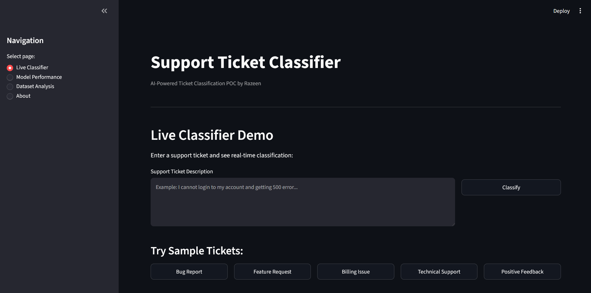
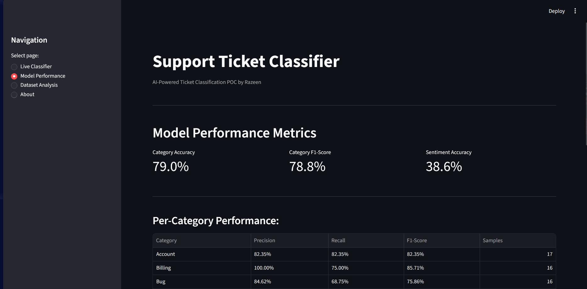
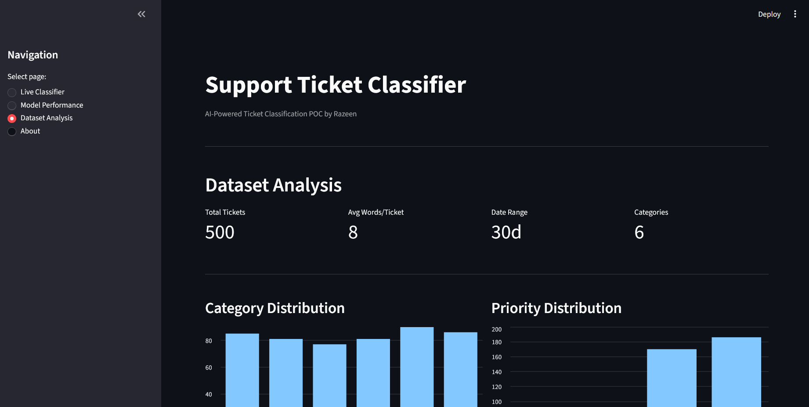
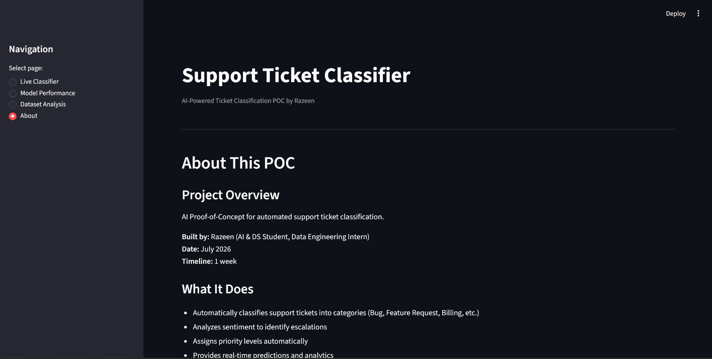

# 🎫 Support Ticket Classifier — AI-Powered POC

An end-to-end proof-of-concept that automatically classifies support tickets by **category**, estimates **sentiment**, and assigns **priority** — built with a synthetic dataset, a scikit-learn ML pipeline, and an interactive Streamlit demo app.

## Overview

This project simulates a real-world customer support workflow: tickets come in as free text, and the system automatically tags them so they can be routed and prioritized without manual triage.

**Pipeline stages:**
1. **Data Generation** — synthetic ticket dataset with realistic category/priority/sentiment correlations
2. **Data Preprocessing & EDA** — text cleaning, validation, and exploratory analysis
3. **ML Pipeline** — TF-IDF + Naive Bayes category classifier, rule-based sentiment analyzer, full evaluation
4. **Interactive Demo** — Streamlit app for live predictions and dashboards

## Features

- 🏷️ **Category classification** — Bug, Feature Request, Billing, Technical Support, Account, Other
- 😊 **Sentiment analysis** — Positive / Neutral / Negative (rule-based keyword matching)
- ⚡ **Auto priority assignment** — derived from category + sentiment
- 📊 **Live dashboards** — dataset analysis, model performance, and per-class metrics
- 🖥️ **Interactive demo UI** — classify tickets in real time, or try sample tickets with one click

## Project Structure

```
Proj 1/
├── 01_data_generation.py              # Phase 1: Generates synthetic ticket dataset
├── 02_data_preprocessing.py           # Phase 1: Validates, cleans, analyzes data
├── 03_ml_pipeline.py                  # Phase 2: Trains models, evaluates performance
├── app_streamlit.py                   # Phase 3: Interactive Streamlit demo app
├── category_classifier.pkl            # Trained classifier model (Phase 2 output)
├── data_raw_tickets.csv               # Raw synthetic tickets (Phase 1 output)
├── data_processed_tickets.csv         # Cleaned/preprocessed tickets (Phase 1 output)
├── eda_report.json                    # EDA report with data summary (Phase 1 output)
├── model_evaluation_report.json       # Model metrics & recommendations (Phase 2 output)
├── requirements.txt                   # Python dependencies
├── README.md                          # This file
└── screenshots/                       # Demo app screenshots
    ├── Live_Classifier.png            # Live ticket classification interface
    ├── Model_Performance.png          # Model metrics dashboard
    ├── Dataset_Analysis.png           # Dataset statistics & visualizations
    └── About_Page.png                 # Project info & tech stack
```

## Tech Stack

| Component | Technology |
|---|---|
| Data Processing | Python (pandas, numpy) |
| ML Framework | scikit-learn |
| NLP | TF-IDF + Multinomial Naive Bayes |
| Sentiment | Rule-based keyword matching |
| Demo Interface | Streamlit |
| Model Serialization | Pickle |

## Screenshots

| Live Classifier | Model Performance |
|---|---|
|  |  |

| Dataset Analysis | About |
|---|---|
|  |  |

## Getting Started

### 1. Clone and install dependencies

```bash
git clone <your-repo-url>
cd <your-repo-name>
pip install -r requirements.txt
```

### 2. Run the pipeline (optional — pre-generated outputs are already included)

```bash
python 01_data_generation.py       # generates data_raw_tickets.csv
python 02_data_preprocessing.py    # generates data_processed_tickets.csv + eda_report.json
python 03_ml_pipeline.py           # generates category_classifier.pkl + model_evaluation_report.json
```

### 3. Launch the demo app

```bash
streamlit run app_streamlit.py
```

The app opens in your browser with four pages: **Live Classifier**, **Model Performance**, **Dataset Analysis**, and **About**.

## Dataset

500 synthetic support tickets generated with realistic correlations between category, priority, and sentiment (e.g. bugs skew toward higher priority; critical-priority tickets skew negative in sentiment).

| Category | Count |
|---|---|
| Other | 90 |
| Technical Support | 86 |
| Account | 85 |
| Feature Request | 81 |
| Billing | 81 |
| Bug | 77 |

## Model Performance

**Category Classifier** (TF-IDF + Multinomial Naive Bayes, 80/20 train-test split):

| Metric | Score |
|---|---|
| Accuracy | 79.0% |
| Precision (weighted) | 80.6% |
| Recall (weighted) | 79.0% |
| F1-score (weighted) | 78.8% |

**Sentiment Analyzer** (rule-based keyword matching):

| Metric | Score |
|---|---|
| Accuracy | 38.6% |

> ⚠️ The sentiment analyzer is a simple keyword-matching baseline and underperforms significantly compared to the category classifier — see [Limitations](#limitations--next-steps) below.

## Limitations & Next Steps

This is a **proof of concept** trained on synthetic, template-based data — not production-ready. Known limitations and planned improvements:

- Trained on synthetic templated tickets rather than real company data; needs fine-tuning on real support tickets before production use
- Rule-based sentiment analyzer is weak (38.6% accuracy) — should be replaced with a pre-trained transformer model
- No dedicated priority prediction model yet — priority is currently derived heuristically from category + sentiment
- Small dataset (500 tickets, 100-sample test set) limits statistical confidence in reported metrics
- Not yet deployed as an API or integrated with a real ticketing system

**Planned next steps:**
1. Fine-tune on real, company-specific support tickets
2. Replace the rule-based sentiment analyzer with a pre-trained NLP model
3. Add a dedicated priority prediction model
4. Deploy as a REST API and integrate with a ticketing system
5. Monitor performance on live data

## Requirements

```
pandas==2.0.3
numpy==1.24.3
scikit-learn==1.3.0
streamlit==1.28.0
plotly==5.17.0
python-dateutil==2.8.2
```

## GitHub Setup

Before pushing to GitHub, create a `.gitignore` file in the root of `Proj 1/`:

```
# Virtual environment
.venv/
venv/
env/

# Python
__pycache__/
*.py[cod]
*$py.class
*.so
.Python

# Jupyter & notebooks
.ipynb_checkpoints/
*.ipynb

# IDE
.vscode/
.idea/
*.swp

# OS
.DS_Store
Thumbs.db

# Large files (optional — customize based on your needs)
# *.pkl
# *.csv
```

This keeps your repo clean by excluding unnecessary files while preserving the trained model and data.

## Author

Built by **Razeen** — AI & DS Student / Data Engineering Intern.

---

*This is a proof-of-concept project intended for demonstration purposes.*
